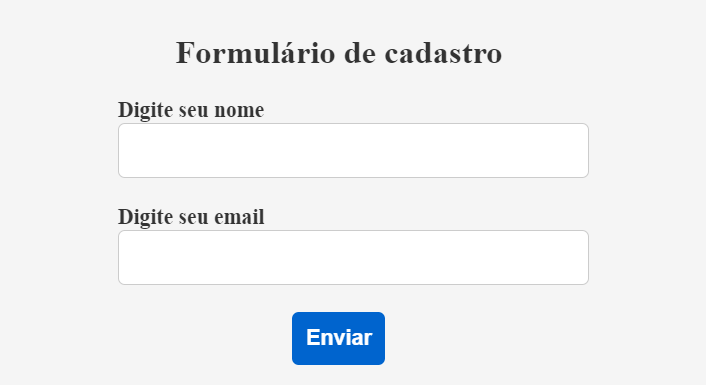
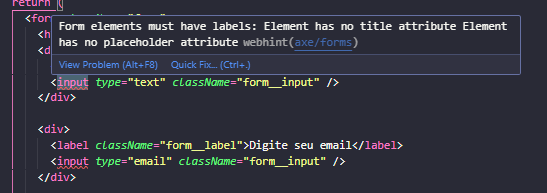
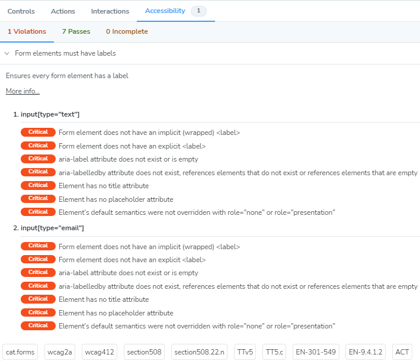
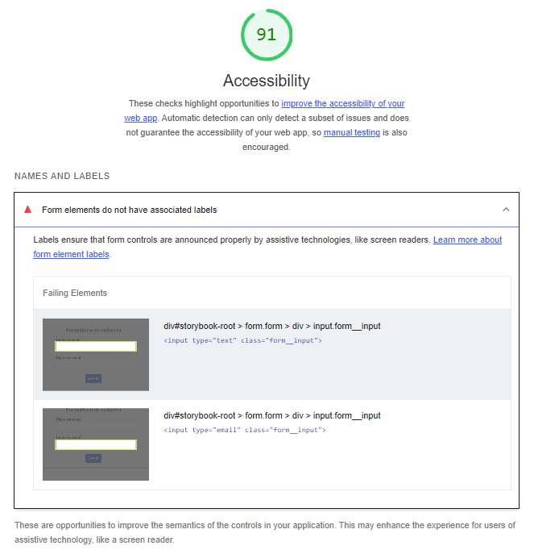
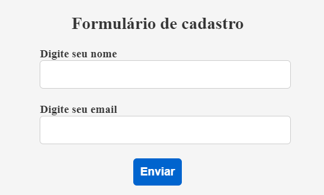
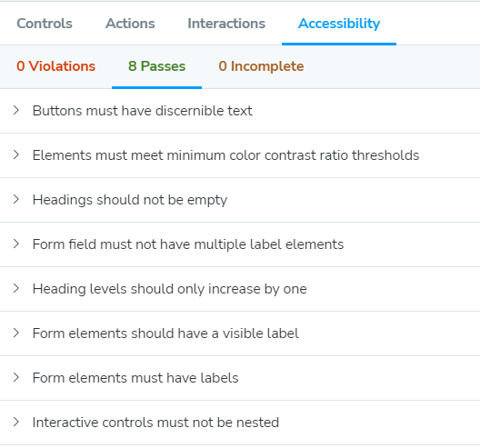
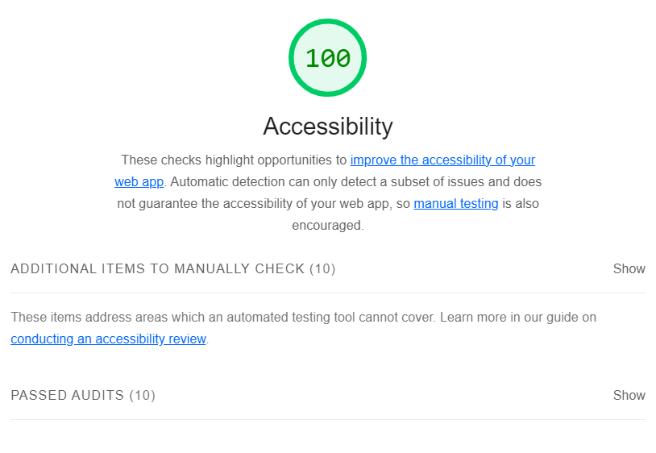

# Caso: Rotulação de inputs em formulários (labels)

O caso analisado é um pequeno formulário com inputs, onde o uso de labels para descrever os inputs é essencial. Esta análise se torna importante, pois trata-se de um problema comum, porém de fácil resolução, uma vez que mais de 1/3 dos inputs não são devidamente rotulados.

Inicialmente, será considerado o componente `InaccessibleForm` do arquivo `Form.tsx`, onde serão aplicadas ferramentas, métricas e abordagens para analisar o caso e corrigir possíveis problemas durante a etapa de desenvolvimento.

Resultado visual do componente inacessível:



```html
<form className="form">
  <h1 className="form__title">Formulário de cadastro</h1>
  <div>
    <label className="form__label">Digite seu nome</label>
    <input type="text" className="form__input" />
  </div>

  <div>
    <label className="form__label">Digite seu email</label>
    <input type="email" className="form__input" />
  </div>

  <div>
    <button type="submit" className="form__button">Enviar</button>
  </div>
</form>
```

## Abordagem de Eficiência

Nesta etapa será utilizada as extensões do VSCode para apoio e o plugin de acessibilidade do Storybook.
Utilizando o mesmo código do componente inacessível obtemos os seguintes feedbacks das ferramentas:

### axe Accessibility Linter e Webhint



Nestas imagens, percebe-se que erros como estes podem ser evitados durante a etapa de desenvolvimento do código. Neste caso, a extensão Webhint identificou a falta de labels em elementos de formulário, especificamente em inputs, visto que no código o label está mal colocado. Por outro lado, a axe Accessibility Linter não conseguiu detectar nenhum erro. Portanto, o uso conjunto dessas extensões é necessário, pois elas se complementam.

Note que sem as extensões, não é possível visualizar algum lint no código para sinalização desse erro.

### Addon/a11y (Storybook)



Observa-se que os erros apontados no código também são disponibilizados por esta ferramenta, juntamente com a indicação de onde foram encontrados e até quais diretrizes foram infringidas neste desenvolvimento. Essas informações aparecem no formato de tags no canto inferior e podem ser utilizadas como chaves de pesquisa para a correção desse problema. Como este relatório gerado é dinâmico e ocorre durante o desenvolvimento, é de grande valia para observar a motivação por trás do problema gerado, como a diretriz e o princípio WCAG infringidos.

## Abordagem Quantitativa

Ao utilizarmos métricas para analisar a acessibilidade do nosso código, recebemos os seguintes feedbacks
das ferramentas:

### Google Lighthouse



De acordo com o feedback do Lighthouse, percebe-se a identificação do problema da falta de labels juntamente com o elemento específico que está inacessível.

## Abordagem Subjetiva

### Leitor de tela (LT)

Para o usuário do leitor de tela, é fundamental a presença dos labels para informar sobre o propósito de cada input, ou seja, que tipo de informação é esperada do usuário. Sem essa descrição adequada, o usuário apenas sabe que deve inserir um dado, mas não tem a clareza do que é esperado.

No feedback fornecido pelo leitor de tela para o componente analisado, temos as seguintes informações:

- Ao navegar para a página, o leitor de tela informa: "Formulário de cadastro" (título) + "Digite seu nome" (primeiro label) + "Digite seu email" (segundo label) + "Enviar" (label do botão).

À primeira vista, parece acessível para usuários que não dependem de leitores de tela. No entanto, essa descrição geral fornecida pelo leitor de tela não reflete a mesma experiência que o usuário tem ao navegar pelo teclado, input por input, para preencher o formulário. Além disso, quanto mais campos houver, mais difícil será a memorização para o usuário, tornando a experiência inviável.

- Ao focar no input de nome: "Editar texto" (input text)
- Ao focar no input de email: "Editar texto, entrada de email" (input email)
- Ao focar no botão: "Enviar" (label) + "Botão" (tag html)

Analisando do ponto de vista do leitor de tela, essas informações carecem de acessibilidade, pois os labels existentes não estão conectados aos inputs, dificultando o entendimento de como inserir os dados para os usuários que dependem de leitores de tela. Surgem perguntas como "Editar texto de quê?" e "Editar entrada de email, mas que tipo de email?". Esses exemplos são simples, mas na prática podem se tornar mais complexos com uma quantidade maior de inputs e informações mais detalhadas.

### Diretrizes do WCAG

Embora as ferramentas tenham fornecido um feedback necessário para correção sem a necessidade de consultar as diretrizes, é importante realizar uma pesquisa sobre o assunto para compreender os aspectos que estão sendo infringidos quando as imagens estão inacessíveis. Após uma breve pesquisa sobre "labels em formulários", descobrimos que este caso se enquadra principalmente no critério de sucesso 3.3.2, que trata das informações necessárias quando se requer dados de entrada do usuário. Além disso, podemos inferir outros aspectos das diretrizes do WCAG:

- Princípio Perceptível

  - Diretriz 1.3 - Adaptável
  - Critério de sucesso 1.3.1 - Informações e relacionamentos (nível A).

- Princípio Operável

  - Diretriz 2.4 - Navegável
  - Critério de sucesso 2.4.6 Headings e labels (nível AA).

- Princípio Compreensível

  - Diretriz 3.3 - Assistência de entrada
  - Critério de sucesso 3.3.2 - Labels ou instruções (nível A).

- Princípio Robusto

  - Diretriz 4.1 - Compatível
  - Critério de sucesso 4.1.2 - Nome, função e valor (nível A)

Detalhes sobre esses critérios podem ser encontradas <a href="https://www.w3.org/TR/WCAG22" aria-label="Diretrizes do WCAG sobre textos alternativos">aqui</a>.

Segundo as diretrizes, existem várias maneiras de contemplar a acessibilidade dos inputs com alguma forma de rotulagem. Algumas delas são:

- Uso da tag `<label>` envolvendo o input, que é recomendada fortemente:

```html
<label className="form__label"
  >Digite seu nome <input type="text" className="form__input"
/></label>
```

- Uso da tag `<label>` com a propriedade `for` (`htmlFor` no React).

```html
<label htmlFor="name" className="form__label">Digite seu nome</label>
<input type="text" id="name" name="name" className="form__input" />
```

- Uso de propriedades como: `aria-label`, `aria-labelledby`, `title` também podém caracterizar a acessiblidade com a devida implementação.

Várias alternativas podem ser implementadas, desde que fornecam a informação correta para o usuário quanto ao input correspondente.

### Feedbacks após a inclusão dos labels para os inputs

O código do componente final pode ser encontrado com o nome `AccessibleForm` no arquivo `Form.tsx`.

Resultado visual do componente `AccessibleForm`, que corresponde ao componente ajustado de acordo com a análise, e das ferramentas:







```html
<form className="form">
  <h1 className="form__title">Formulário de cadastro</h1>
  <div>
    <label className="form__label">
      Digite seu nome
      <input type="text" className="form__input" />
    </label>
  </div>

  <div>
    <label className="form__label">
      Digite seu email
      <input type="email" className="form__input" />
    </label>
  </div>

  <div>
    <button type="submit" className="form__button">Enviar</button>
  </div>
</form>
```

O LT proferiu as seguintes informações após a correção:

- Ao focar no input de nome: "Digite seu nome" (label) + "Editar texto" (input text)
- Ao focar no input de email: "Digite seu email" (label) + "Editar texto, entrada de email" (input email)

## Análise do caso

Para analisar o caso, vamos observar como as ferramentas e abordagens utilizadas podem ser úteis para identificar o problema de acessibilidade em destaque e como foram importantes para auxiliar na correção.

| Caso                               | Extensões VSCode | Addon/a11y | Lighthouse | Leitor de Tela |
| ---------------------------------- | ---------------- | ---------- | ---------- | -------------- |
| Rotulação de inputs em formulários | Sim              | Sim        | Sim        | Sim            |

Conforme a tabela, todas as ferramentas e abordagens utilizadas podem identificar a falta de acessibilidade quando os inputs em formulários não são corretamente rotulados. Embora nem todas as ferramentas precisem ser usadas na prática, a adoção de todas as abordagens é importante para garantir um complemento e uma compreensão abrangente dos problemas.

Enquanto as ferramentas automatizadas são eficazes para identificar o erro, somente o LT pode confirmar que, mesmo que o erro não seja visível na interface do usuário, ele afeta a compreensão do conteúdo por usuários que dependem de LTs. Portanto, o uso conjunto das ferramentas é fundamental para promover o desenvolvimento acessível. Essa abordagem simples pode fazer uma grande diferença na vida de muitos usuários ao usar formulários online.
