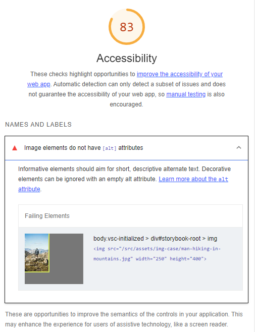

# Componente Image

O componente analisado contém uma imagem e têm como foco a presença de textos alternativos para sua análise de acessibilidade. Este caso é um dos mais comuns encontrados ao longo dos sites na web.
No uso inicial, será considerado o componente `InaccessibleImage` do arquivo `Image.tsx`, onde será utilizado ferramentas, métricas e abordagens para analisar o caso e sua correção quanto a etapa de desenvolvimento.

Resultado visual do componente inacessível:

## Abordagem de Eficiência

Nesta etapa será utilizada as extensões do VSCode para apoio e o plugin de acessibilidade do Storybook.
Utilizando o mesmo código do componente inacessível obtemos os seguintes feedbacks das ferramentas:

### axe Accessibility Linter e Webhint

Nestas imagens, percebe-se que erros como estes podem ser evitados durante a etapa do desenvolvimento do código. Neste caso, ambas geraram o mesmo feedback.

### Addon/a11y (Storybook)

Observa-se que os erros apontados em código, também são disponibilizados por esta ferramenta juntamente de onde foram encontrados, e
até quais diretrizes foram infringidas neste desenvolvimento. Como este report gerado é dinâmico e acontece durante o desenvolvimento é de grande valia para observar a motivação por trás do problema gerado, como a diretriz e o princípio WCAG infringido.

## Abordagem Quantitativa

Ao utilizarmos métricas para analisar a acessibilidade do nosso código, recebemos os seguintes feedbacks
das ferramentas:

### Google Lighthouse

Aqui podemos observar que a pontuação atingida foi afetada por infringir a regra de ausência de atributos [alt] para elementos de imagens.

## Abordagem Subjetiva

### Leitor de tela (LT)

Para o leitor de tela é necessário a presença de textos alternativos em imagens para conseguir prover ao usuáro um feedback com propriedade da imagem analisada. O leitor de tela quando passa pela imagem sem texto alternativo informa apenas "image" que corresponde a tag. Portanto, não há a descrição correta para o usuário a cerca do conteúdo da imagem.

### Diretrizes do WCAG

Embora as ferramentas tenham provido um feedback necessário para correção sem a consulta das diretrizes, pode-se pesquisar a cerca do assunto a fim de observar aos aspectos que estão sendo infringidos quando as imagens estão inacessíveis. Após uma breve pesquisa sobre "textos alternativos em imagens", encontra-se que este caso se enquadra nos seguintes aspectos das diretrizes do WCAG:

- Princípio Perceptível
  - Diretriz 1.1 - Textos Alternativos
  - Critério de sucesso 1.1.1 - Conteúdo não textual com nível A

Detalhes sobre esse critério podem ser encontradas <a href="https://www.w3.org/TR/WCAG22/#non-text-content" aria-label="Diretrizes do WCAG sobre textos alternativos">aqui</a>.

Além da propriedade [alt], para contemplar a acessibilidade podem ser utilizadas as seguintes propriedades como alternativas:

- <i>title</i>
- <i>aria-label</i>
- <i>aria-labelledby</i> (usando a corretamente)

Um ponto a se ressaltar é que a descrição da imagem seja feita o mais rica possível, evitando descrições curtas, ou palavras que não façam sentido com o conteúdo da imagem. Em alguns casos, onde a imagem é apenas decorativa, o simples fato de deixar o texto alternativo como vazio ("") é suficiente para evitar a inacessibilidade do mesmo.

### Feedbacks após a inclusão de um texto alternativo para a imagem

Resultado visual do componente `AccessibleImage`, que corresponde ao componente ajustado de acordo com a análise e, então acessível:

O LT proferiu a seguinte informação ao usuário "Homem de costas caminhando entre as montanhas", o que neste caso é a informação contida no atributo [alt], assim tornando a imagem acessível.

## Análise do caso

Para analisar o caso, vamos observar como as ferramentas e abordagens utilizadas podem ser úteis para este caso, ou seja, quais que foram necessárias para a identificação
do problema acessibilidade em destaque, e foram de grande valia para o auxílio na correção.

| Caso                           | Extensões VSCode | Addon/a11y | Lighthouse | Leitor de Tela |
| ------------------------------ | ---------------- | ---------- | ---------- | -------------- |
| Textos alternativos em imagens | Sim              | Sim        | Sim        | Sim            |

Conforme a tabela, conclui-se que todas as ferramentas e abordagens utilizadas podem identificar a falta de acessibilidade quando não há a presença de textos alternativos em imagens.
Neste caso, não há a necessidade da utilização de todas ferramentas e abordagens, visto que podem ser eliminadas no código, porém foi utilizada todas as ferramentas a fim de complementar a análise como um todo.
Embora, este caso seja simples e de fácil análise, é recorrente ao longo da internet, visto que segundo pesquisas atuais, cerca de 1/3 das imagens da internet não contém textos alternativos, ou sofrem com problemas de acessibilidade.
