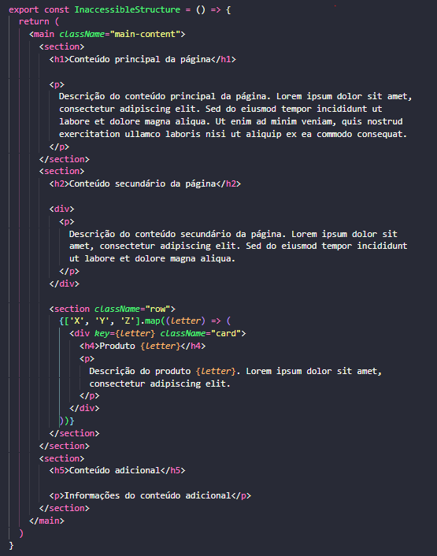

# Componente Structure

O caso em destaque contém uma estruturação de HTML com foco em organizações de seções de páginas por headings, na qual deve estar presente em todos os sites para facilitar a navegação do usuário pelo conteúdo. O componente Structure conta com uma estrutura básica com foco na organização dos headings pelo seus níveis. Este caso é bem comum nos sites e afeta diretamente a acessibilidade e SEO das suas páginas.

O foco de seu desenvolvimento e análise é observar como podemos evitar a estruturação equivocada dos headings com as abordagens deste trabalho.
No uso inicial, será considerado o componente `InaccessibleStructure` do arquivo `Structure.tsx`, onde este é desenvolvido apenas considerando a sua estruturação normal, focando muito mais pelo lado visual, visto que às vezes os desenvolvedores utilizam níveis de headings de acordo com sua estilização, o que é não é correto. Posteriormente será utilizado as ferramentas, métricas e abordagens para analisar o caso e entender como elas podem, de certa forma, auxiliar na inclusão da acessibilidade.

Resultado visual do componente inacessível:

## Abordagem de Eficiência

Nesta etapa será utilizada as extensões do VSCode para apoio e o plugin de acessibilidade do Storybook.

### axe Accessibility Linter e Webhint

Utilizando o mesmo código do componente inacessível, observado na figura abaixo, percebe-se que o código realiza a funcionalidade visual final esperada e não recebe nenhum feedback das extensões, mostrando que teoricamente não há erros de acessibilidade, ou não são possíveis de compreender com estas ferramentas.

### Addon/a11y (Storybook)

Ao analisar com as métricas oferecidas pelo <i>addon/a11y</i>, observa-se que há uma irregularidade no seu desenvolvimento.

Este relatório indica que há um problema na order semântica dos headings.

## Abordagem Quantitativa

### Google Lighthouse

Utilizando do apoio do Ligthouse para observar as métricas quantitativas do desenvolvimento pode-se inferir também que foi violado a regra sobre a ordenação sequencial dos headings da página.

Este feedback é redundante ao provido pelo addon/a11y, porém reforça a necessidade de correção.

## Abordagem Subjetiva

É importante aqui utilizar todas as abordagens possíveis neste desenvolvimento, pois são, de fato, complementares.

### Leitor de tela (LT)

Para o leitor de tela utilizaremos de sua leitura de conteúdo textual e estrutural para observar a estruturação da página, visto que o caso abordado não utiliza de componentes navefáveis via teclado.

No feedback provido pelo LT, observa-se que ele segue uma leitura a acerca do conteúdo, lendo títulos, parágrafos e assim por diante. No caso, apenas quando clica-se em cima de um título consegue-se perceber o destaque do nível do título.
Pode-se desconfiar que não há uma descendência correta da ordem dos títulos na estruturação das seções, porém, não é de fácil identificação. Dito isso, é plausível afirmar que o LT não foi de grande valia para avaliação da acessibilidade por parte do desenvolvedor, visto que este não detém as mesmas percepções de pessoas utilizam dos LTs.

### Diretrizes do WCAG

Segundo uma breve pesquisa na documentação do W3C, baseado nos feedbacks providos pelo addon/a11y e Lighthouse observamos algumas modificações devem ser realizadas para obedecerem os seguintes aspectos das diretrizes do WCAG:

- Princípio Perceptível (técnica <b>Consultiva</b>)

  - Diretriz 1.3 - Adaptável
  - Critério de sucesso 1.3.1 - Informações e relacionamentos com (nível A).

- Princípio Operável (técncica <b>Suficiente</b>)

  - Diretriz 2.4 - Navegável
  - Critério de sucesso 2.4.10 - Ordem de foco (nível AAA).

Detalhes sobre esses critérios podem ser encontradas <a href="https://www.w3.org/TR/WCAG22" aria-label="Diretrizes do WCAG sobre as diretrizes">aqui</a>.

Para adequar a acessibilidade a este componente foi reaalizado a seguinte correção:

Substituiu-se o nível dos headings de acordo com o seu precedente. No caso, antes encontrava-se os headings na seguinte ordem: "h1-h2-h4-h4-h4-h2", e agora pode ser observado na seguinte ordem "h1-h2-h3-h3-h3-h2". Dessa forma, evitando-se que as seções recebam títulos que a nomeiem com pesos indevidos, atrapalhando a navegação pelo conteúdo dos usuários nos LTs.

Mais informações sobre este problema podem ser encontradas em:

- <a href="https://www.w3.org/WAI/WCAG22/Understanding/section-headings.html">Documentação do critério 2.4.10</a>
- <a href="https://www.w3.org/WAI/WCAG22/Techniques/general/G141">Técnica para alcançar este critério</a>

### Feedbacks após a inclusão de um texto alternativo para a imagem

O código do componente final pode ser encontrado com o nome `AccessibleStructure` no arquivo `Structure.tsx`.

Após essas alterações, foram recebidos os seguintes feedbacks das ferramentas:

O feedback mais detalhado do LT não demonstra nenhuma irregularidade ao avançar o conteúdo entre as seções, visto que agora os títulos contém pesos satisfatórios em relação a sua estrutura.

## Análise do caso

Para analisar o caso, vamos observar como as ferramentas e abordagens utilizadas podem ser úteis para este caso, ou seja, quais que foram necessárias para a identificação do problema acessibilidade em destaque, e foram de grande valia para o auxílio na correção. É importante frisar, que esta tabela passa pelo ponto de vista do desenvolvedor.

| Caso                                | Extensões VSCode | Addon/a11y | Lighthouse | Leitor de Tela | WCAG |
| ----------------------------------- | ---------------- | ---------- | ---------- | -------------- | ---- |
| Estruturação de seções por headings | Não              | Sim        | Sim        | Não\*          | Sim  |

\* Com ressalvas para uma análise mais detalhada, na qual o LT poderia ser útil, embora sua abordagem não seja tão simples para o desenvolvedor.

Conforme a tabela, fica evidente que tanto o Addon/a11y do Storybook quanto o Lighthouse conseguiram identificar de maneira eficaz o erro na estruturação dos headings nas seções. Esse sucesso reforça a utilidade dessas ferramentas para análise de erros de acessibilidade durante o desenvolvimento. Apesar do LT não ter fornecido um resultado satisfatório, ele contou com o suporte complementar das ferramentas automatizadas para promover a inclusão da acessibilidade, seguindo as diretrizes do WCAG.
