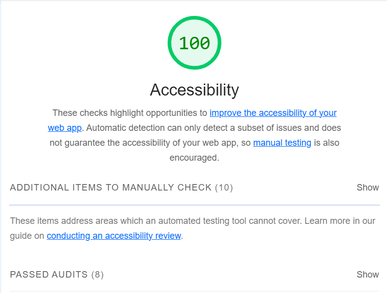

# Componente Tab

O caso em destaque contém o componente de UI Tab, que é bastante utilizado nos mais variados sites. O componente Tab, nada mais é que um separador de conteúdo onde em uma lista de Tabs, pretende-se ter vários conteúdos diferentes a partir da ativação de sua tab correspondente.

O foco de seu desenvolvimento e análise é observar como as abordagens deste trabalho podem auxiliar no desenvolvimento deste trabalho.
No uso inicial, será considerado o componente "InaccessibleTab", onde este é desenvolvido apenas considerando a sua função visual, sem incluir nenhuma abordagem acessível. Posteriormente será utilizado as ferramentas, métricas e abordagens para analisar o caso e entender como elas podem, de certa forma, auxiliar na inclusão da acessibilidade.

Resultado visual do componente inacessível:

## Abordagem de Eficiência

Nesta etapa será utilizada as extensões do VSCode para apoio e o plugin de acessibilidade do Storybook.

### axe Accessibility Linter e Webhint

Utilizando o mesmo código do componente inacessível, observado na figura abaixo, percebe-se que o código realiza a funcionalidade visual final esperada e não recebe nenhum feedback das extensões, mostrando que teoricamente não há erros de acessibilidade, ou não são possíveis de compreender com estas ferramentas.

### Addon/a11y (Storybook)

Ao analisar com as métricas oferecidas pelo <i>addon/a11y</i>, observa-se que não há irregularidades neste desenvolvimento e, por isso, não oferecendo nenhuma correção.

## Abordagem Quantitativa

### Google Lighthouse

Utilizando do apoio do Ligthouse para observar as métricas quantitativas do desenvolvimento pode-se inferir também, que não houve nenhum erro violado possível de observar pela ferramenta.

Obs.: Após a utilização das ferramentas nenhuma irregularidade foi encontrada por elas, o que exemplifica uma situação onde a ferramenta não pode alcançar. O motivo, neste caso, é que não há erro por parte do desenvolvimento para as ferramentas encontrarem, e sim um erro na construção da estrutura para o componente tab, que visualmente aparente estar funcionando, mas pode não estar corretamente estruturado.

## Abordagem Subjetiva

É importante aqui utilizar todas as abordagens possíveis neste desenvolvimento, pois são, de fato, complementares.

### Leitor de tela (LT)

Para o leitor de tela utilizaremos de sua navegação pelas tabs e pelos painéis de conteúdo das tabs para tentar compreender o conteúdo que ali está fornecido, dado o funcionamento natural esperado do componente tab.
Com o apoio do LT, recebemos os seguintes feedbacks para:

- Tab selecionada [tab]: "Produtos" (label) + "Botão" (tag html)
- Tab não selecionada [tab]: "Serviços" (label) + "Botão" (tag html)
- Painél de conteúdo [tabpanel]: "Computadores, monitores, mouses, teclados, etc." (texto)

Analisando do ponto de vista visual, pode parecer correto, visto que os labels e textos estão aparentemente conectados. Entretanto, não há conexão no HTML entre a tab e o painel, então apenas aqueles que conseguem enxergar podem identificar com facilidade qual tab corresponde a qual painel. Além disso, para aqueles que necessitam do leitor de tela, estes não sabem quando a tab está selecionada, ou não, e nem quantas tabs existem, o que dificulta a compreensão desses usuários. Assim sendo, entende-se que este componente está com uma acessibilidade baixa. Desta forma, será necessário pesquisar nas diretrizes do WCAG sobre a acessibilidade deste componente.

### Diretrizes do WCAG

Segundo uma breve pesquisa na documentação do W3C observamos algumas modificações devem ser realizadas para obedecerem os seguintes aspectos das diretrizes do WCAG:

- Princípio Perceptível

  - Diretriz 1.3 - Adaptável
  - Critério de sucesso 1.3.1 - Informações e relacionamentos com (nível A).

- Princípio Operável

  - Diretriz 2.1 - Teclado acessível
  - Critério de sucesso 2.1.1 - Teclado com (nível A).
  - Diretriz 2.4 - Navegável
  - Critério de sucesso 2.4.3 - Ordem de foco (nível A).

- Princípio Robusto

  - Diretriz 4.1 - Compatível
  - Critério de sucesso 4.1.2 - Nome, função e valor com (nível A)

Detalhes sobre esses critérios podem ser encontradas <a href="https://www.w3.org/TR/WCAG22" aria-label="Diretrizes do WCAG sobre as diretrizes">aqui</a>.

Para adequar a acessibilidade a este componente foi adicionado os seguintes atributos:

- [role="tablist"] no componente pai das tabs, para compreender como uma "lista de separadores" e o seu [aria-label="Tabs de conteúdo"] para descrever essa lista
- [role="tab"] para a tab em si, junto com
  - [id] para identificar a tab
  - [tabIndex] dinâmico para a navegação do teclado correta
  - [aria-controls] para identificar o painel associado a tab respectiva
  - [aria-selected] para indicar se a tab está selecionada
- [role="tabpanel] para identificar o container/painel com o conteúdo da tab ativa
  - [id] para identificar o painel
  - [aria-hidden] para identificar se o elemento está escondido
  - [aria-labelledby] para se referir a tab que controla o painel

Além desses atributos, foi inserido uma lógica adicional para a navegação do componente.
Para o ajuste correto segundo as diretrizes, usou-se de base a seguinte <a href="https://www.w3.org/WAI/ARIA/apg/patterns/tabs/examples/tabs-manual/" aria-label="Documentação do W3C sobre o componente tab">documentação</a>

### Feedbacks após a inclusão de um texto alternativo para a imagem

Após essas alterações, foram recebidos os seguintes feedbacks das ferramentas

Considerando a primeira tab selecionada por padrão, o LT proferiu os seguintes feedbacks:

- Lista de tabs [tablist]: "Tabs de conteúdo" (aria-label) + "Produtos" (label da tab selecionada)
- Tab selecionada [tab]: "Produtos" (label) + "Tab" (role) + "selecionado" (aria-selected) + "1 de 3" (referência do número de itens e qual posição está)
- Tab não selecionada [tab]: "Serviços" (label) + "Tab" (role) + "não selecionado" (aria-selected) + "2 de 3" (referência do número de itens e qual posição está)
- Painél de conteúdo [tabpanel]: "Computadores, monitores, mouses, teclados, etc." (texto) + "Produtos" (aria-labelledby referenciando a tab) + "Painel de separadores" (role tablist)

## Análise do caso

Para analisar o caso, vamos observar como as ferramentas e abordagens utilizadas podem ser úteis para este caso, ou seja, quais que foram necessárias para a identificação
do problema acessibilidade em destaque, e foram de grande valia para o auxílio na correção.

| Caso                 | Extensões VSCode | Addon/a11y | Lighthouse | Leitor de Tela |
| -------------------- | ---------------- | ---------- | ---------- | -------------- |
| Componente de UI Tab | Não              | Não        | Não        | Sim            |

Conforme a tabela, conclui-se que nenhuma ferramenta automatizada conseguiu auxiliar na correção de forma significativa, visto que para o entendimento de inclusão de acessibilidade neste componente necessitaria do auxílio do LT para uma análise subjetiva do desenvolvedor. Dito isso, entendemos que nem sempre as ferramentas automatizadas serão suficientes para garantir a acessibilidade, por isso, a importância da combinação das ferramentas e análises no desenvolvimento.

Conferindo os resultados finais, pós-correção baseados nas diretrizes do WCAG, observa-se que tanto o addon/a11y e o Lighthouse proveram mais critérios de avaliação em seu relatório. Somando a isso, analisando o feedback do LT, percebemos que agora existe um feedback acessível aos usuários com alguma deficiência. Portanto, compreendemos que neste caso o LT foi peça fundamental para a inclusão da acessibilidade, o que destaca o seu uso para o desenvolvimento e testes de acessibilidade.
